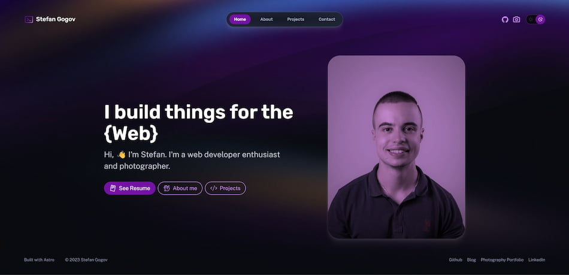

# Portfolio Website using Astro Starter Kit

[](https://astro.build/)
[](LICENSE)
[](https://app.netlify.com/sites/stekatag-portfolio/deploys)

## About the Project

This is a portfolio website built using [Astro](https://astro.build/), a static site generator that delivers lightning-fast performance and embraces the JAMstack philosophy. The blog is built using the Astro starter kit

## [Live Demo](https://sgogov.dev/)



## Pages

- Home
- About
- Projects
- Contact

## How to Contribute

If you'd like to contribute, please follow these steps:

1. Fork the repository.
2. Create a new branch for your changes.
3. Make your enhancements or additions.
4. Submit a pull request, describing the changes you've made.

## Getting Started

To run the project locally, you'll need Node.js and npm installed on your system. Follow these steps to get started:

1. Clone this repository to your local machine.
2. Install the project dependencies with `npm install`.
3. Start the development server with `npm run dev.`
4. Open your browser and visit http://localhost:3000 to see the project in action.

## Project Structure

Inside of your Astro project, you'll find the following directories and files:

```text
/
├── public/
│   └── ...
├── src/
│   ├── components/
│   │   └── ...
│   ├── layouts/
│   │   └── ...
│   └── pages/
│       └── ...
└── package.json
```

Astro looks for `.astro` or `.md` files in the `src/pages/` directory. Each page is exposed as a route based on its file name.

Any static assets, like images, can be placed in the `public/` directory. These files will be copied into the final build.

## Reporting Issues

If you come across any bugs, have suggestions for improvements, or want to request new features, please submit an issue in the GitHub repository. Your feedback is highly appreciated!

## License

This project is licensed under the General Public License v3.0. See the [LICENSE](LICENSE) file for details.
